<p align="center">
  
</p>

<br>

<p align="center">
  <h3><code>$ cat contributions.sh</code></h3>
  <a href="https://github.com/Vivek-2108">
    
  </a>
</p>

<br>

<p align="center">
  <h3><code>$ whoami --verbose</code></h3>
</p>

<table align="center" border="0">
  <tr>
    <td align="center" valign="top">
      
    </td>
    <td align="center" valign="top">
      
    </td>
  </tr>
</table>

<br>

### 🚀 `$ ls -la ./featured_projects`

| Project | Description | Tech Stack | Repository |
| :--- | :--- | :--- | :--- |
| **Terminal Profile README Engine** | Autonomous vector graphics profile generator with daily automated data pipelines. | `Python` `SVG` `GitHub Actions` | [View Repository](https://github.com/Vivek-2108/Vivek-2108) |
| **Android & Web Applications** | Full-stack mobile & web applications focused on performance and modern design. | `Java` `React` `Node.js` `Firebase` | [View Repositories](https://github.com/Vivek-2108?tab=repositories) |

<br>

### 🏆 `$ cat cp_stats.sh`

<p align="center">
  
</p>

<br>

### 🛠️ `$ neofetch --tech-stack`

<p align="center">
  
  &nbsp;
  
  &nbsp;
  
  &nbsp;
  
  &nbsp;
  
  &nbsp;
  
  &nbsp;
  
  &nbsp;
  
</p>

<br>

### 🌐 `$ cat profiles.sh`

<p align="center">
  <a href="https://codeforces.com/profile/Code_da_vinci" target="_blank">
    
  </a>
  &nbsp;&nbsp;
  <a href="https://leetcode.com/u/vivekjadhav07/" target="_blank">
    
  </a>
  &nbsp;&nbsp;
  <a href="https://www.linkedin.com/in/vivek-jadhav-290a39301/" target="_blank">
    
  </a>
</p>

---

## 🖥️ Terminal Profile Architecture & Self-Hosting Guide

This repository contains a fully automated, self-hosted, terminal-themed GitHub Profile README for **[Vivek-2108](https://github.com/Vivek-2108)**.

All animated visuals are vector SVG graphics generated locally via Python scripts with embedded CSS keyframe animations. It uses **zero JavaScript**, **no third-party stats services**, and **no GitHub Personal Access Tokens**.

---

### 📂 Project Structure

```
Vivek-2108/
├── README.md                           # Terminal profile landing page
├── ascii.svg                           # Self-typing animated ASCII portrait
├── info-card.svg                       # Animated Neofetch-style terminal info card
├── contrib-heatmap.svg                 # Live animated GitHub contribution heatmap SVG
├── cp-stats.svg                        # Codeforces & LeetCode statistics SVG card
│
├── assets/
│   ├── profile.jpg                     # Original input profile image
│   └── prepared.png                    # Preprocessed contrast & background image
│
├── data/
│   ├── contributions.json              # Parsed contribution matrix & streak dataset
│   ├── codeforces.json                 # Live Codeforces rating, rank & solved metrics
│   └── leetcode.json                   # Live LeetCode solved breakdown & contest ranking
│
├── scripts/
│   ├── config.py                       # Single source of truth configuration
│   ├── prep_photo.py                   # Image pre-processing (rembg + CLAHE)
│   ├── make_ascii_svg.py               # Animated monochrome ASCII SVG generator
│   ├── make_info_card.py               # Neofetch info card SVG generator
│   ├── fetch_github_contributions.py   # Web scraper for GitHub contribution graph
│   ├── fetch_codeforces.py             # Official Codeforces REST API stats fetcher
│   ├── fetch_leetcode.py               # Public LeetCode profile & contest fetcher
│   ├── render_heatmap_svg.py           # Animated heatmap SVG generator
│   ├── render_cp_stats_svg.py          # Codeforces & LeetCode stats SVG renderer
│   └── requirements.txt                # Python dependencies
│
└── .github/
    └── workflows/
        └── update-profile.yml          # Daily GitHub Actions cron automation
```

---

### 🚀 Quick Start & Local Execution

```bash
# 1. Environment Setup
python3 -m venv .venv
source .venv/bin/activate
pip install -r scripts/requirements.txt

# 2. Fetch Live Stats & Render All SVGs
python scripts/fetch_github_contributions.py
python scripts/fetch_codeforces.py
python scripts/fetch_leetcode.py

python scripts/make_ascii_svg.py
python scripts/make_info_card.py
python scripts/render_heatmap_svg.py
python scripts/render_cp_stats_svg.py
```
