<p align="center">
  
</p>

<br>

<p align="center">
  <h3><code>$ cat contributions.sh</code></h3>
  <a href="https://github.com/vivekjadhav07">
    
  </a>
</p>

<br>

<p align="center">
  <h3><code>$ whoami --verbose</code></h3>
</p>

<table align="center" border="0">
  <tr>
    <td align="center" valign="top">
      
    </td>
    <td align="center" valign="top">
      
    </td>
  </tr>
</table>

<br>

<p align="center">
  <h3><code>$ ls -la ./socials</code></h3>
  <a href="https://linkedin.com/in/vivek-jadhav-520867220/">
    
  </a>
  &nbsp;
  <a href="https://instagram.com/vivek_jadhav28">
    
  </a>
  &nbsp;
  <a href="mailto:vivek.jadhav@example.com">
    
  </a>
</p>

<br>
<hr>
<br>

## 🖥️ Terminal Profile Architecture & Self-Hosting Guide

This repository contains a fully automated, self-hosted, terminal-themed GitHub Profile README for **[vivekjadhav07](https://github.com/vivekjadhav07)**.

All animated visuals are vector SVG graphics generated locally via Python scripts with embedded CSS/SMIL keyframe animations. It uses **zero JavaScript**, **no third-party stats services**, and **no GitHub Personal Access Tokens**.

---

### 📂 Repository Structure

```
vivekjadhav07/
│
├── README.md                # Terminal profile landing page
├── ascii.svg                # Self-typing animated ASCII portrait
├── info-card.svg            # Animated Neofetch-style terminal info card
├── contrib-heatmap.svg      # Live animated GitHub contribution heatmap SVG
│
├── assets/
│   ├── profile.jpg          # Original input profile image
│   └── prepared.png         # Preprocessed CLAHE & background-removed image
│
├── data/
│   └── contributions.json   # Parsed contribution matrix & streak dataset
│
├── scripts/
│   ├── requirements.txt     # Python dependencies
│   ├── prep_photo.py        # Image pre-processing (rembg + CLAHE)
│   ├── make_ascii_svg.py    # Animated monochrome ASCII SVG generator
│   ├── make_info_card.py    # Neofetch info card SVG generator
│   ├── fetch_contributions.py # Web scraper for GitHub contribution HTML
│   └── render_heatmap_svg.py  # Animated heatmap SVG generator
│
└── .github/
    └── workflows/
        └── update-profile-art.yml # Daily GitHub Actions cron automation
```

---

### 🚀 Quick Start & Local Setup

#### 1. Prerequisites
- Python 3.10+
- Virtual environment (`venv`)

#### 2. Environment Setup
```bash
# Clone repository
git clone https://github.com/vivekjadhav07/vivekjadhav07.git
cd vivekjadhav07

# Create and activate virtual environment
python3 -m venv .venv
source .venv/bin/activate

# Install dependencies
pip install -r scripts/requirements.txt
```

#### 3. Run Pipeline Locally

```bash
# 1. Process profile photo (rembg background removal + CLAHE contrast enhancement)
python scripts/prep_photo.py

# 2. Generate self-typing ASCII portrait SVG
python scripts/make_ascii_svg.py

# 3. Generate Neofetch terminal info card SVG
python scripts/make_info_card.py

# 4. Scrape live contribution data
python scripts/fetch_contributions.py

# 5. Render contribution heatmap SVG
python scripts/render_heatmap_svg.py
```

---

### ⚙️ Script Documentation

| Script | Responsibility | Key Inputs & Outputs |
| :--- | :--- | :--- |
| **`prep_photo.py`** | Uses `rembg` AI model to eliminate backgrounds, applies OpenCV CLAHE contrast enhancement, converts image to grayscale, and composites over a solid canvas. | **In:** `assets/profile.jpg`<br>**Out:** `assets/prepared.png` |
| **`make_ascii_svg.py`** | Maps image pixels to density-matched ASCII characters. Embeds staggered CSS row keyframe animations (`@keyframes typeRow`) for a left-to-right typing effect. | **In:** `assets/prepared.png`<br>**Out:** `ascii.svg` |
| **`make_info_card.py`** | Reads profile metadata from a Python dictionary and outputs a terminal card with line-by-line slide/fade animations and color badges. | **In:** `PROFILE_DATA` dict<br>**Out:** `info-card.svg` |
| **`fetch_contributions.py`** | Web scrapes `https://github.com/users/vivekjadhav07/contributions` via `requests` and `BeautifulSoup`. Computes total contributions, active streaks, and max streaks without tokens. | **In:** GitHub Public HTML<br>**Out:** `data/contributions.json` |
| **`render_heatmap_svg.py`** | Generates a 53-week vector heatmap calendar with rounded grid cells, dark mode green palette, metric summary boxes, and a staggered diagonal reveal animation. | **In:** `data/contributions.json`<br>**Out:** `contrib-heatmap.svg` |

---

### 🎨 Customization Guide

#### 1. Change Neofetch Card Details
Open [`scripts/make_info_card.py`](file:///home/vivek-jadhav/Desktop/Github%20stuff/vivekjadhav07/scripts/make_info_card.py) and modify the `PROFILE_DATA` dictionary:
```python
PROFILE_DATA = {
    "whoami": "your_username",
    "name": "Your Name",
    "role": "Your Role",
    "stack": {
        "Languages": "Java, Python, JS",
        # ...
    }
}
```
Then run: `python scripts/make_info_card.py`

#### 2. Change Profile Photo & ASCII Resolution
- Replace `assets/profile.jpg` with your own photo.
- In [`scripts/make_ascii_svg.py`](file:///home/vivek-jadhav/Desktop/Github%20stuff/vivekjadhav07/scripts/make_ascii_svg.py), adjust `DEFAULT_CHAR_WIDTH` (default `58`) or character ramp `ASCII_RAMP`.
- Run `python scripts/prep_photo.py && python scripts/make_ascii_svg.py`.

#### 3. Customize Heatmap Color Palette
In [`scripts/render_heatmap_svg.py`](file:///home/vivek-jadhav/Desktop/Github%20stuff/vivekjadhav07/scripts/render_heatmap_svg.py), tweak `COLOR_MAP` to use custom HSL or Hex colors.

---

### 🤖 GitHub Actions Daily Cron Workflow

Automated via `.github/workflows/update-profile-art.yml`:
- **Schedule**: Every day at `00:00 UTC`.
- **Action**: Fetches contribution HTML, re-calculates streaks, regenerates `contrib-heatmap.svg` and `data/contributions.json`, and commits updates back to the repo using `[skip ci]`.

---

### 🛠️ Troubleshooting Notes

- **`rembg` Backend Error**: If running in lightweight environments, ensure `onnxruntime` is installed via `pip install "rembg[cpu]"`.
- **SVG Animation Playback**: All SVG animations use CSS keyframes (`animation-fill-mode: forwards`). They play once upon loading in GitHub markdown `` context. To replay, refresh the browser page.
- **Scraper Rate Limits**: The contribution scraper accesses public HTML headers. If GitHub alters DOM classes, `fetch_contributions.py` falls back gracefully to standard table cell inspection.
